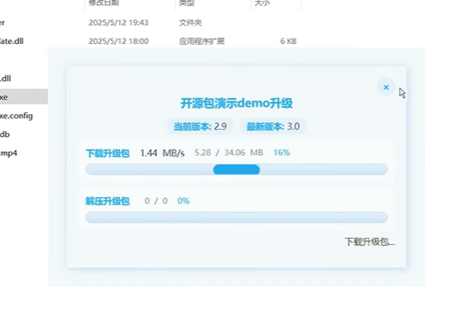

# LingYanAutoUpdateServer

#### 描述
这是一个自动更新程序，专为winform,wpf,maui应用程序设计。它提供了一种简单的方式来实现应用程序的自动升级功能。

#### 联系开发者

[站长官网](https://www.lingyanspace.com/) 

[视频演示](https://www.bilibili.com/video/BV1RaEGz9EwB?spm_id_from=333.788.videopod.sections&vd_source=4e9f2b51092b6853379566144b71b13a)

#### 软件架构
该程序基于.NET框架构建，并利用了WPF技术来提供图形界面。它包含一个用于处理自动更新逻辑的核心库和一个用于展示更新过程的用户界面。

#### 安装
1. 如果你使用的是.NET Framework项目，可以直接通过NuGet包安装。
2. 如果你使用的是.NET Core项目，则需要额外步骤将`UpdateAppFloder`文件夹的内容复制到你的项目中。

##### NuGet包源设置
- 名称：任意名称
- 源：https://nuget.lingyanspace.com/v3/index.json

#### 使用说明
1. 配置自动更新信息：
   ```csharp
   // 参数1：窗体标题
   // 参数2：升级压缩包的URL
   // 参数3：存放最新版本号的文件路径
   // 参数4：本地版本号
   // 参数5：服务器上的版本号
   LingYanAutoUpdateManager.Setting("测试升级", updateURL, "my.txt", "1.0", "2.0");
   ```
2. 当需要检查并执行更新时调用：
   ```csharp
   LingYanAutoUpdateManager.ToRun();
   ```
#### 升级包界面

#### 注意事项
- 如果是.NET Framework项目，直接安装NuGet包即可使用。
- 如果是.NET Core项目，除了安装NuGet包外，还需要手动复制虚拟文件夹`UpdateAppFloder`中的内容到项目的相应位置。

#### 贡献
欢迎对项目进行贡献。如果您希望添加新功能或修复bug，请提交Pull Request。

#### 如有帮助，请开发者一杯奶茶 


